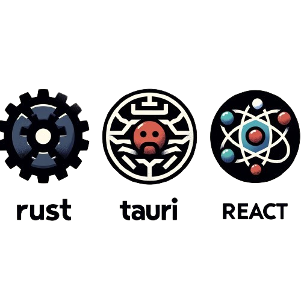

  

# LSCode - Rust & Tauri Code Editor

Este é o repositório para o LSCode, um editor de código personalizado criado com a intenção de aprender e explorar tecnologias modernas de desenvolvimento de software. Este editor é construído usando Rust e Tauri para o backend, proporcionando performance e segurança, com uma interface de usuário criada com React e JavaScript.

## Tecnologias Utilizadas

- **Rust:** Linguagem de programação para o backend, garantindo segurança de memória e concorrência sem dados compartilhados.
- **Tauri:** Framework para a criação de aplicações desktop leves com front-end em tecnologias web.
- **React:** Biblioteca JavaScript para construir interfaces de usuário com componentes reutilizáveis e eficientes.
- **JavaScript:** Linguagem de programação para o desenvolvimento do front-end.

## Scripts Disponíveis

No diretório do projeto, você pode executar:

### `yarn dev`

Executa o aplicativo no modo de desenvolvimento. A aplicação será aberta em uma janela nativa e você poderá ver os erros de lint no terminal.

### `yarn build:tauri`

Compila o aplicativo para produção na pasta `src-tauri/target/release`. Isso empacota seu código React e o backend Rust em um executável desktop nativo.

### `yarn test`

Inicia o executor de testes em modo interativo. Veja a seção sobre [execução de testes](https://jestjs.io/docs/en/getting-started) para mais informações (substitua por documentação relevante para seus testes).

## Aprendendo Mais

- Para aprender mais sobre Rust, confira a [documentação do Rust](https://www.rust-lang.org/learn).
- Para entender como Tauri funciona e como construir aplicações com ele, veja a [documentação do Tauri](https://tauri.studio/en/docs/getting-started/intro).
- A documentação do React está disponível em [React documentation](https://reactjs.org/).

## Contribuições

Contribuições são bem-vindas! Se você tem ideias para melhorar este editor ou quer contribuir com o código, fique à vontade para criar issues ou pull requests.

## Licença

Este projeto está sob a licença MIT. Veja o arquivo `LICENSE` para mais detalhes.
